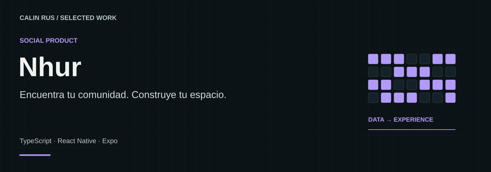

# Nhur

**Encuentra tu comunidad. Construye tu espacio.**

Una red social en desarrollo como alternativa a Amino, donde crear comunidades, explorar nichos y conectar con personas que comparten tus intereses. Combina conversación inspirada en Discord, descubrimiento tipo Reddit y publicaciones modulares al estilo Notion.

**Stack:** TypeScript · React Native · Expo  
**Estado:** Preview local en desarrollo

[Portfolio](https://github.com/calinrus-dev/portfolio) · [Experiencia](docs/EXPERIENCIA.md) · [Componentes](docs/COMPONENTES.md) · [Diseño técnico](docs/ARQUITECTURA.md) · [Demostraciones](docs/DEMOSTRACIONES.md) · [Estado](docs/ESTADO.md)

## El problema que aborda

Las comunidades necesitan un lugar que conserve su identidad y permita tanto conversar como crear contenido con estructura. Nhur nace de mi interés por recuperar esa experiencia de comunidad y combinarla con formas más flexibles de participar, publicar y descubrir.

## Qué compone la experiencia

- **Comunidades y Entornos.** Espacios temáticos para crear comunidades y reunir intereses compartidos.
- **Canales y Máscaras.** Conversaciones y presencia contextual dentro de cada comunidad.
- **Entradas modulares.** Publicaciones con texto, citas, listas y encuestas mediante Smart Blocks.
- **Identidad Glow.** Lenguaje visual expresivo que forma parte de la experiencia de Nhur.

*Lámina explicativa con datos ficticios. Su contenido también está disponible como texto en [Componentes](docs/COMPONENTES.md).*

## Decisiones que definen el proyecto

- **El nicho tiene identidad propia.** Cada comunidad necesita contexto, conversación y espacio para expresarse.
- **Una publicación puede ser un pequeño documento.** Los Smart Blocks permiten componer Entradas con distintas piezas de contenido.
- **Glow evoluciona dentro de Nhur.** El nombre anterior da paso al producto actual; Glow continúa como parte de su estética y lenguaje visual.

## Explorar el caso

- [Experiencia y recorrido](docs/EXPERIENCIA.md): intención, interacción y criterios de revisión.
- [Componentes](docs/COMPONENTES.md): las piezas visibles y el papel de cada una.
- [Diseño técnico](docs/ARQUITECTURA.md): responsabilidades y compromisos de diseño.
- [Demostraciones](docs/DEMOSTRACIONES.md): qué enseñan las imágenes y cómo leer la evidencia.
- [Estado y siguientes pasos](docs/ESTADO.md): alcance actual, comprobaciones y trabajo pendiente.

## Sobre este repositorio

Caso de estudio público de un proyecto con implementación privada. Reúne documentación, diagramas e imágenes seleccionadas. Los detalles del motor, integraciones, datos operativos y código se mantienen en los repositorios privados.

Revisión editorial: 28 de septiembre de 2026. Autor: [Calin Rus](https://github.com/calinrus-dev).

[calinrus.com](https://calinrus.com) · [Instagram @c4linrus](https://www.instagram.com/c4linrus/) · [Todos los proyectos](https://github.com/calinrus-dev/portfolio)
