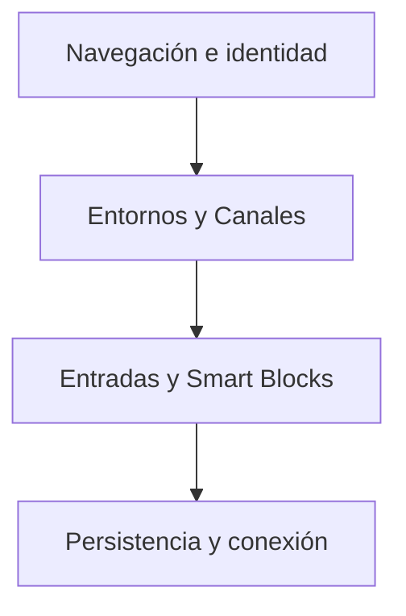

# Nhur / Diseño técnico

[← Inicio](../README.md)

## Contexto

Una red social en desarrollo como alternativa a Amino, donde crear comunidades, explorar nichos y conectar con personas que comparten tus intereses. Combina conversación inspirada en Discord, descubrimiento tipo Reddit y publicaciones modulares al estilo Notion.

**Tecnologías asociadas al proyecto:** TypeScript · React Native · Expo.

## Mapa de responsabilidades

Este mapa conceptual organiza la explicación del producto; no representa endpoints, procesos desplegados ni contratos internos.

## El nicho tiene identidad propia

Cada comunidad necesita contexto, conversación y espacio para expresarse.

## Una publicación puede ser un pequeño documento

Los Smart Blocks permiten componer Entradas con distintas piezas de contenido.

## Glow evoluciona dentro de Nhur

El nombre anterior da paso al producto actual; Glow continúa como parte de su estética y lenguaje visual.

## Rendimiento y dependencia

Mi criterio de trabajo es medir antes de optimizar: identificar el recorrido relevante, observar tiempo de respuesta y uso de recursos y comparar cambios con la misma carga. En sistemas nativos también me interesa la disposición de datos, la localidad de memoria y el trabajo repetido.

Local-first es una preferencia arquitectónica: conservar una experiencia útil y control sobre los datos en el dispositivo, e incorporar servicios externos cuando aporten una función concreta. Su alcance varía por proyecto; no implica que todas las integraciones de este caso funcionen sin conexión.

No se publican cifras de rendimiento sin un ensayo identificado. La evidencia específica disponible está en [Estado](ESTADO.md).

## Qué conviene demostrar después

- Estabilizar la preview e integración de comunidades.
- Validar cuentas, conversación y continuidad entre dispositivos.
- Evolucionar Entradas, moderación y accesibilidad con casos de uso reales.
