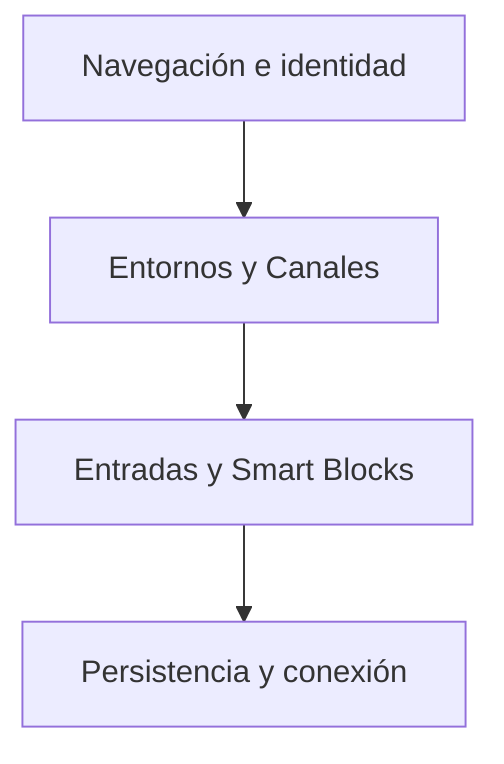

# Nhur / Diseño técnico

[← Inicio](../README.md)

## Contexto

Una plataforma social organizada en Entornos, Canales y Entradas, donde la identidad y la apariencia cambian con el contexto.

**Tecnologías asociadas al proyecto:** TypeScript · React Native · Expo.

## Mapa de responsabilidades

Este mapa conceptual organiza la explicación del producto; no representa endpoints, procesos desplegados ni contratos internos.

## El contexto organiza

Global abre el descubrimiento; Entornos y Canales aportan profundidad y significado.

## Expresión con límites

Los temas y efectos acompañan a la lectura; las preferencias de accesibilidad tienen prioridad.

## Demostración diferenciada

Los ejemplos locales se distinguen de una cuenta conectada y de personas reales.

## Rendimiento y dependencia

Mi criterio de trabajo es medir antes de optimizar: identificar el recorrido relevante, observar tiempo de respuesta y uso de recursos y comparar cambios con la misma carga. En sistemas nativos también me interesa la disposición de datos, la localidad de memoria y el trabajo repetido.

Local-first es una preferencia arquitectónica: conservar una experiencia útil y control sobre los datos en el dispositivo, e incorporar servicios externos cuando aporten una función concreta. Su alcance varía por proyecto; no implica que todas las integraciones de este caso funcionen sin conexión.

No se publican cifras de rendimiento sin un ensayo identificado. La evidencia específica disponible está en [Estado](ESTADO.md).

## Qué conviene demostrar después

- Estabilizar el entorno de ejecución de la preview.
- Validar cuentas reales, conectividad y persistencia entre dispositivos.
- Ampliar moderación, accesibilidad y gestión del ciclo de vida de datos.
