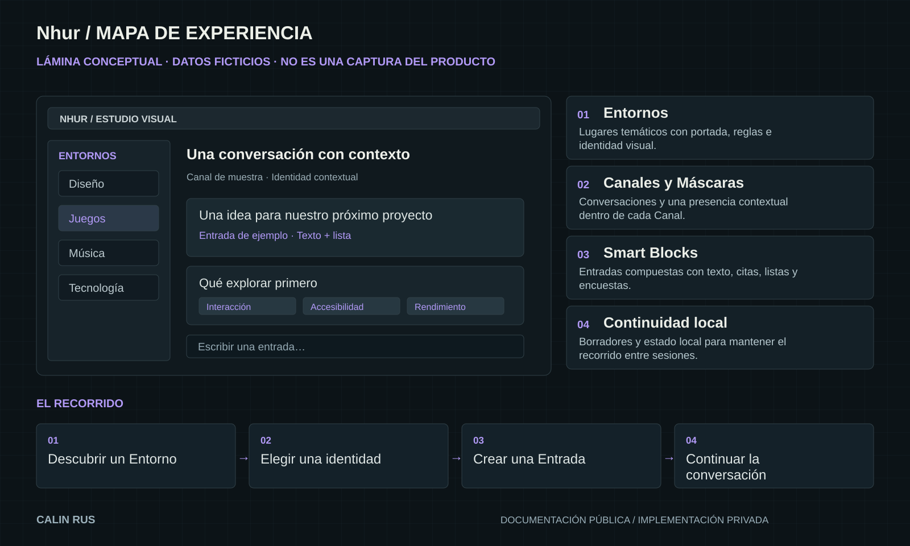

# Nhur / Componentes de producto

[← Inicio](../README.md)

Lámina conceptual con contenido ficticio. Las piezas de esta página describen la experiencia y sus responsabilidades visibles.

## 01 / Entornos

Lugares temáticos con portada, reglas e identidad visual.

**En el recorrido:** Descubrir un Entorno.

**Responsabilidad relacionada:** Navegación e identidad.

## 02 / Canales y Máscaras

Conversaciones y una presencia contextual dentro de cada Canal.

**En el recorrido:** Elegir una identidad.

**Responsabilidad relacionada:** Entornos y Canales.

## 03 / Smart Blocks

Entradas compuestas con texto, citas, listas y encuestas.

**En el recorrido:** Crear una Entrada.

**Responsabilidad relacionada:** Entradas y Smart Blocks.

## 04 / Continuidad local

Borradores y estado local para mantener el recorrido entre sesiones.

**En el recorrido:** Continuar la conversación.

**Responsabilidad relacionada:** Persistencia y conexión.

## Relación entre las piezas

Descubrir un Entorno → Elegir una identidad → Crear una Entrada → Continuar la conversación.

El recorrido permite discutir jerarquía, navegación y continuidad. La representación se simplifica a propósito y no publica los contratos internos de implementación.

[Explorar decisiones de diseño](ARQUITECTURA.md)
